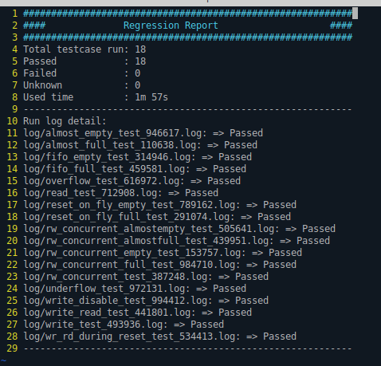
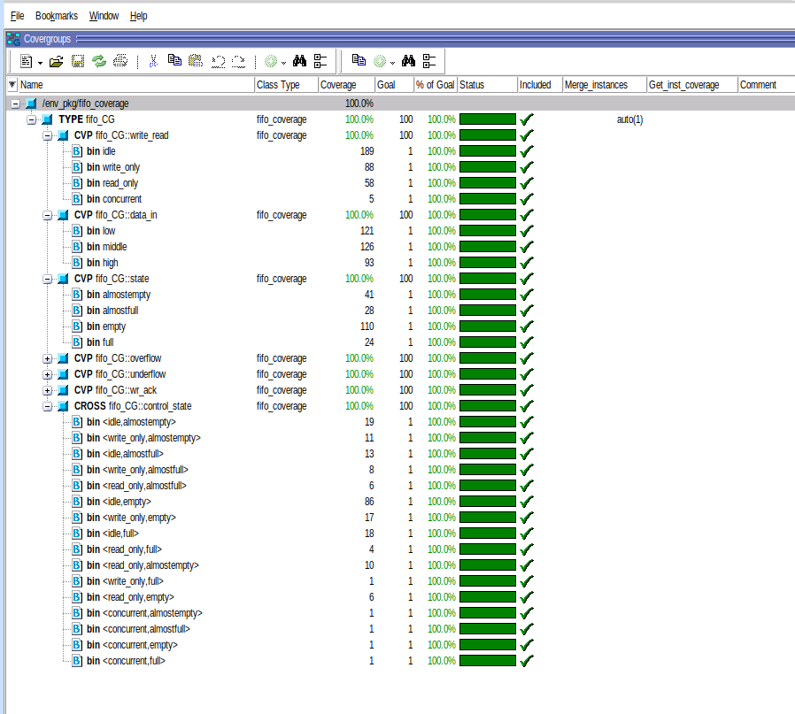

# Synchronous FIFO — UVM Verification

## Overview
UVM-based verification environment for a **parameterizable Synchronous FIFO** (16-bit data width, 8-entry depth).

The testbench verifies all core FIFO operations including write, read, concurrent read/write, boundary conditions (full, empty, almost-full, almost-empty), overflow, underflow, and reset-on-the-fly scenarios.

## Architecture
```
+----------------+       +-----------+       +----------+
|   Test Cases   | ----> |  FIFO VIP | ----> | FIFO DUT |
| (18 directed)  |       | (UVM Env) |       | (RTL)    |
+----------------+       +-----------+       +----------+
                               |
                    +----------+----------+
                    |                     |
              +-----------+      +----------------+
              | Scoreboard|      | Coverage Model |
              +-----------+      +----------------+
```

## Key Features
- **UVM methodology** with full agent (driver, monitor, sequencer)
- **SVA assertions** in interface for protocol checking
- **Self-checking scoreboard** with reference model
- **Functional coverage** with cross-coverage (control × state)
- **18 directed test cases** covering all verification scenarios
- **Regression automation** via Perl script + Makefile

## Directory Structure
`
sync_fifo/
├── rtl/            # FIFO DUT (Verilog)
├── fifo_vip/       # UVM agent components
├── sequences/      # Write, read, concurrent sequences
├── tb/             # Environment, scoreboard, coverage
├── testcases/      # 18 directed test cases
└── sim/            # Makefile, regression scripts
`

## Results

### Regression
All **18/18** test cases passed.



### Functional Coverage



## Tools
- **Simulator**: QuestaSim / ModelSim
- **Methodology**: UVM 1.2
- **Language**: SystemVerilog
